Regression-type modeling & time series decomposition
====================================================

Data loading
------------

Our data: BeerWineUS.csv - monthly retail sales of beer, wine and liquor
in the U.S. in January 1992 - November 2017 (Source: Federal Reserve
Bank of St. Louis).

! File BeerWineUS.csv have to be in working directory for correct
execution of the code.

The last 5 years of data will be cutted for the test purpose.

General time-series plot
------------------------

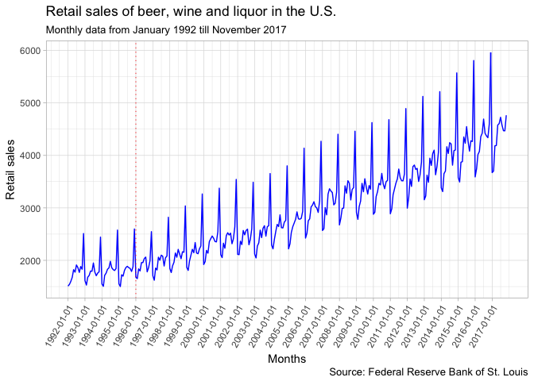

Red line marks an approximate start of the sales growth (1996).

Regression-type modelling and forecasting
=========================================

Linear regression on the months
-------------------------------

    ## 
    ## Call:
    ## lm(formula = coredata(BeerWineUS_xts_train) ~ month(index(BeerWineUS_xts_train)))
    ## 
    ## Residuals:
    ##      Min       1Q   Median       3Q      Max 
    ## -1140.86  -576.35   -92.25   546.15  1893.34 
    ## 
    ## Coefficients:
    ##                                    Estimate Std. Error t value Pr(>|t|)
    ## (Intercept)                         2089.05      88.92  23.493  < 2e-16
    ## month(index(BeerWineUS_xts_train))    75.80      12.12   6.253 1.74e-09
    ##                                       
    ## (Intercept)                        ***
    ## month(index(BeerWineUS_xts_train)) ***
    ## ---
    ## Signif. codes:  0 '***' 0.001 '**' 0.01 '*' 0.05 '.' 0.1 ' ' 1
    ## 
    ## Residual standard error: 660.9 on 249 degrees of freedom
    ## Multiple R-squared:  0.1357, Adjusted R-squared:  0.1322 
    ## F-statistic:  39.1 on 1 and 249 DF,  p-value: 1.74e-09

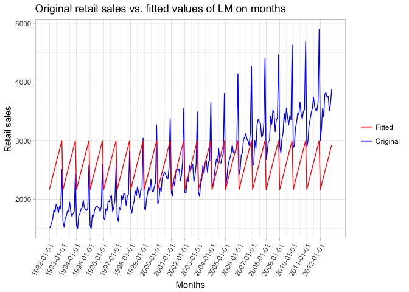

As we can see, we havent extracted trend & and in-year seasonal periond
by applying months as a predictor, and months are not significant as a
predictor in LM. Only some seasonal component for sales growth in
december each year. Then we have to check ACF of model residuals & do
Durbin-Watson test.

    ## 
    ##  Durbin-Watson test
    ## 
    ## data:  lm_w_month_var
    ## DW = 0.25588, p-value < 2.2e-16
    ## alternative hypothesis: true autocorrelation is greater than 0

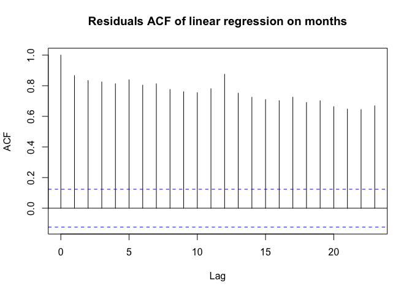

ACF plot shows us a lot of unextracted information on every lag of
autocorelation & Durbin-Watson test for autocorrelation of disturbances
also tells that there's sagnificant autocorrelation.

Month- and seasonplots
----------------------

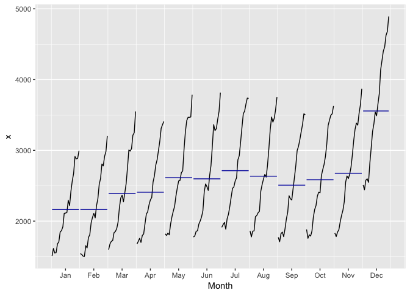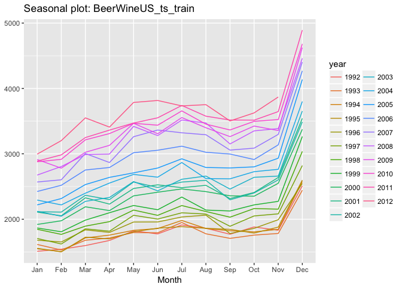

On a monthplot we can see that there's almost consistant (with some
breaks) growth for each month during the years, so maybe we have to add
a year dummy variable to a regression.

On a seasonalplot we see in-year growth from January to July, then
decline to September, then again small growth to November and then a
spike in December. So ve can also use it for creating more dummies - one
for in-year periods and a separate one for spike in December.

Regression models with different variations of predictors
---------------------------------------------------------

**Predictors: years + quarters + months + growth after 1995:**

    ## 
    ## Call:
    ## lm(formula = coredata(BeerWineUS_xts_train) ~ vars_train$years + 
    ##     vars_train$quarters + vars_train$months + vars_train$growth)
    ## 
    ## Residuals:
    ##    Min     1Q Median     3Q    Max 
    ## -512.8 -169.8  -23.6  135.9  880.3 
    ## 
    ## Coefficients:
    ##                       Estimate Std. Error t value Pr(>|t|)    
    ## (Intercept)         -2.159e+05  7.105e+03 -30.395  < 2e-16 ***
    ## vars_train$years     1.090e+02  3.564e+00  30.597  < 2e-16 ***
    ## vars_train$quarters -2.321e+02  5.946e+01  -3.904 0.000122 ***
    ## vars_train$months    1.509e+02  1.929e+01   7.824 1.51e-13 ***
    ## vars_train$growth   -1.977e+02  5.468e+01  -3.616 0.000363 ***
    ## ---
    ## Signif. codes:  0 '***' 0.001 '**' 0.01 '*' 0.05 '.' 0.1 ' ' 1
    ## 
    ## Residual standard error: 249.2 on 246 degrees of freedom
    ## Multiple R-squared:  0.8786, Adjusted R-squared:  0.8766 
    ## F-statistic:   445 on 4 and 246 DF,  p-value: < 2.2e-16

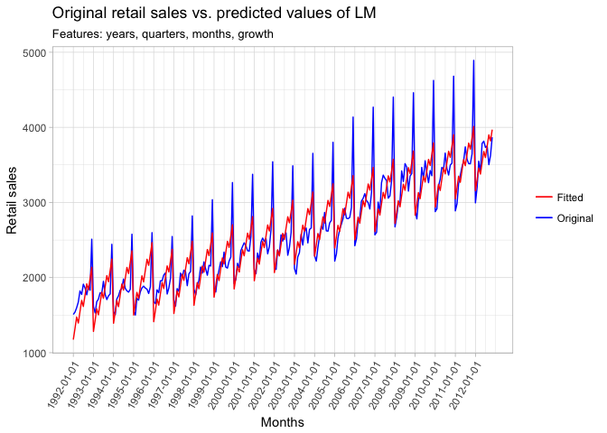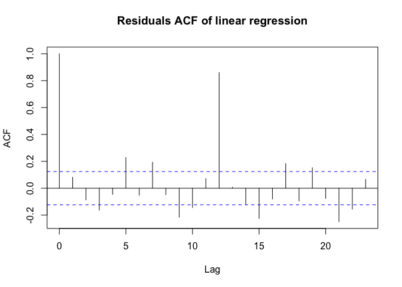

    ## 
    ##  Durbin-Watson test
    ## 
    ## data:  lm_yr_qt_mo_grow
    ## DW = 1.8288, p-value = 0.06787
    ## alternative hypothesis: true autocorrelation is greater than 0

**Predictors: years + in-year periods + growth after 1995:**

    ## 
    ## Call:
    ## lm(formula = coredata(BeerWineUS_xts_train) ~ vars_train$years + 
    ##     vars_train$month_periods + vars_train$growth)
    ## 
    ## Residuals:
    ##     Min      1Q  Median      3Q     Max 
    ## -516.42 -203.82  -25.22  189.31  782.39 
    ## 
    ## Coefficients:
    ##                            Estimate Std. Error t value Pr(>|t|)    
    ## (Intercept)              -2.163e+05  7.600e+03 -28.464  < 2e-16 ***
    ## vars_train$years          1.092e+02  3.812e+00  28.646  < 2e-16 ***
    ## vars_train$month_periods  2.570e+02  1.679e+01  15.305  < 2e-16 ***
    ## vars_train$growth        -1.989e+02  5.848e+01  -3.401 0.000784 ***
    ## ---
    ## Signif. codes:  0 '***' 0.001 '**' 0.01 '*' 0.05 '.' 0.1 ' ' 1
    ## 
    ## Residual standard error: 266.6 on 247 degrees of freedom
    ## Multiple R-squared:  0.8605, Adjusted R-squared:  0.8588 
    ## F-statistic:   508 on 3 and 247 DF,  p-value: < 2.2e-16

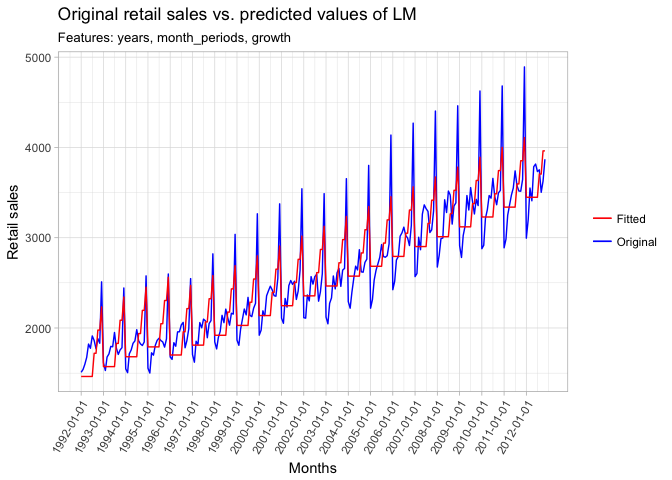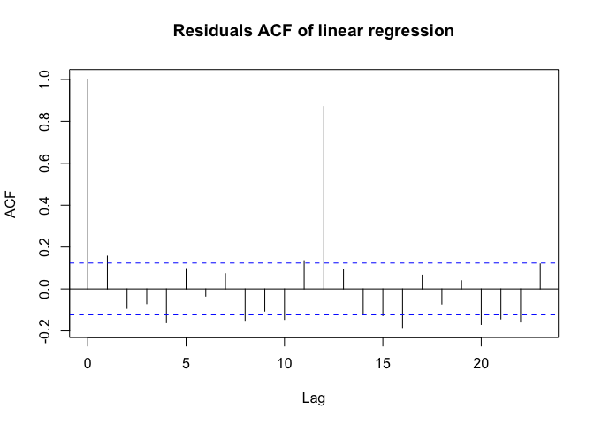

    ## 
    ##  Durbin-Watson test
    ## 
    ## data:  lm_yr_moper_grow
    ## DW = 1.6858, p-value = 0.003897
    ## alternative hypothesis: true autocorrelation is greater than 0

**Predictors: years + quarters + months + December spike + growth after
1995:**

    ## 
    ## Call:
    ## lm(formula = coredata(BeerWineUS_xts_train) ~ vars_train$years + 
    ##     vars_train$quarters + vars_train$months + vars_train$is_december + 
    ##     vars_train$growth)
    ## 
    ## Residuals:
    ##     Min      1Q  Median      3Q     Max 
    ## -407.30 -109.39   -0.44  116.33  357.49 
    ## 
    ## Coefficients:
    ##                          Estimate Std. Error t value Pr(>|t|)    
    ## (Intercept)            -2.177e+05  4.575e+03 -47.577  < 2e-16 ***
    ## vars_train$years        1.099e+02  2.295e+00  47.896  < 2e-16 ***
    ## vars_train$quarters    -1.133e+01  4.007e+01  -0.283 0.777613    
    ## vars_train$months       5.054e+01  1.353e+01   3.734 0.000234 ***
    ## vars_train$is_december  8.291e+02  4.442e+01  18.665  < 2e-16 ***
    ## vars_train$growth      -2.043e+02  3.521e+01  -5.803    2e-08 ***
    ## ---
    ## Signif. codes:  0 '***' 0.001 '**' 0.01 '*' 0.05 '.' 0.1 ' ' 1
    ## 
    ## Residual standard error: 160.5 on 245 degrees of freedom
    ## Multiple R-squared:  0.9499, Adjusted R-squared:  0.9488 
    ## F-statistic: 928.5 on 5 and 245 DF,  p-value: < 2.2e-16

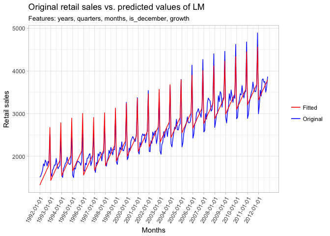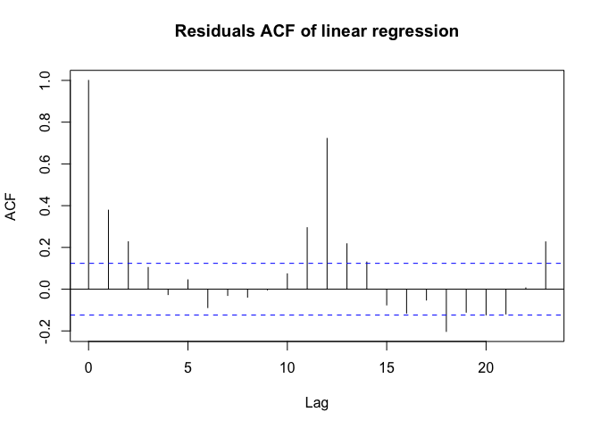

    ## 
    ##  Durbin-Watson test
    ## 
    ## data:  lm_yr_qt_mo_dec_grow
    ## DW = 1.2367, p-value = 3.025e-10
    ## alternative hypothesis: true autocorrelation is greater than 0

**Predictors: years + months + in-year periods + December spike + growth
after 1995:**

    ## 
    ## Call:
    ## lm(formula = coredata(BeerWineUS_xts_train) ~ vars_train$years + 
    ##     vars_train$month_periods + vars_train$months + vars_train$is_december + 
    ##     vars_train$growth)
    ## 
    ## Residuals:
    ##     Min      1Q  Median      3Q     Max 
    ## -407.30  -90.32    0.30   97.88  332.25 
    ## 
    ## Coefficients:
    ##                            Estimate Std. Error t value Pr(>|t|)    
    ## (Intercept)              -2.176e+05  3.936e+03 -55.285  < 2e-16 ***
    ## vars_train$years          1.099e+02  1.975e+00  55.669  < 2e-16 ***
    ## vars_train$month_periods -2.018e+02  2.175e+01  -9.278  < 2e-16 ***
    ## vars_train$months         8.903e+01  5.379e+00  16.550  < 2e-16 ***
    ## vars_train$is_december    1.075e+03  4.488e+01  23.950  < 2e-16 ***
    ## vars_train$growth        -2.043e+02  3.029e+01  -6.745 1.09e-10 ***
    ## ---
    ## Signif. codes:  0 '***' 0.001 '**' 0.01 '*' 0.05 '.' 0.1 ' ' 1
    ## 
    ## Residual standard error: 138.1 on 245 degrees of freedom
    ## Multiple R-squared:  0.9629, Adjusted R-squared:  0.9621 
    ## F-statistic:  1272 on 5 and 245 DF,  p-value: < 2.2e-16

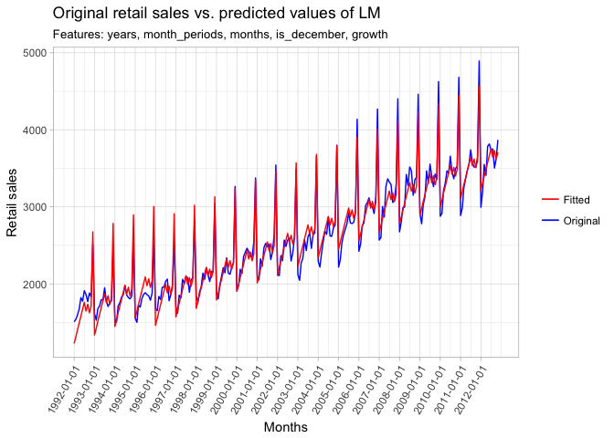

    ## 
    ##  Durbin-Watson test
    ## 
    ## data:  lm_yr_mo_moper_dec_grow
    ## DW = 1.7048, p-value = 0.005465
    ## alternative hypothesis: true autocorrelation is greater than 0

**Predictors: years + quarters + months + in-year periods + December
spike + growth after 1995 (all dummy features):**

    ## 
    ## Call:
    ## lm(formula = yr_qt_mo_moper_dec_grow)
    ## 
    ## Residuals:
    ##     Min      1Q  Median      3Q     Max 
    ## -407.30  -93.86   -2.91   89.50  332.25 
    ## 
    ## Coefficients:
    ##                 Estimate Std. Error t value Pr(>|t|)    
    ## (Intercept)   -2.177e+05  3.914e+03 -55.615  < 2e-16 ***
    ## years          1.099e+02  1.963e+00  55.996  < 2e-16 ***
    ## quarters       6.958e+01  3.531e+01   1.970   0.0499 *  
    ## months         6.847e+01  1.173e+01   5.838 1.67e-08 ***
    ## month_periods -2.124e+02  2.228e+01  -9.533  < 2e-16 ***
    ## is_december    1.110e+03  4.811e+01  23.081  < 2e-16 ***
    ## growth        -2.043e+02  3.011e+01  -6.785 8.74e-11 ***
    ## ---
    ## Signif. codes:  0 '***' 0.001 '**' 0.01 '*' 0.05 '.' 0.1 ' ' 1
    ## 
    ## Residual standard error: 137.3 on 244 degrees of freedom
    ## Multiple R-squared:  0.9635, Adjusted R-squared:  0.9626 
    ## F-statistic:  1073 on 6 and 244 DF,  p-value: < 2.2e-16

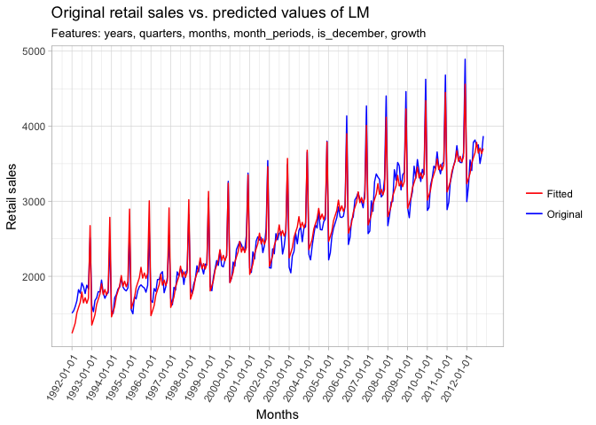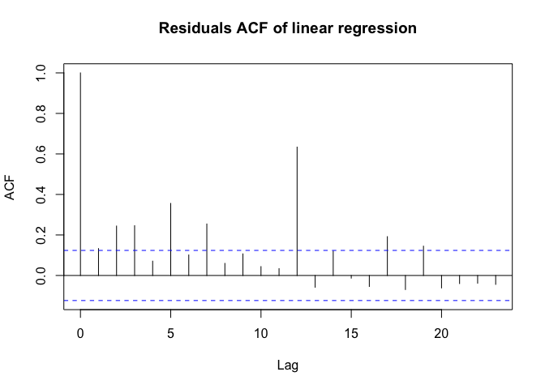

    ## 
    ##  Durbin-Watson test
    ## 
    ## data:  lm_yr_qt_mo_moper_dec_grow
    ## DW = 1.7128, p-value = 0.00719
    ## alternative hypothesis: true autocorrelation is greater than 0

At firs sight, better modeling results we receive adding all or almost
all predictors. If we do not add the in-year periods we have a straight
line during the year; If we do not add December spike vpredictor, we do
not cover yearly December sales growth; If we do not add moths as a
variable, we do not cover January decline.

Then we have to look at the loss-functions MSE, MAE, MAPE and also
consider AIC.

Model with all possible variables hav the best results by all the
metrics between compared models, so we'll use it to try to predict sales
on the test set.

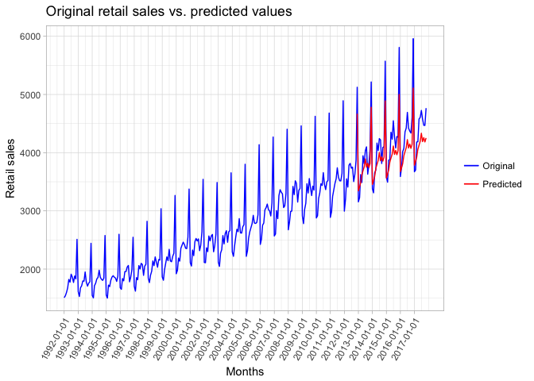

    ##           MSE      MAE       MAPE
    ## [1,] 100894.3 262.2885 0.05931864

Sadly, but we highly underestimated growth of the sales and volatility
on the test set, probably because growth is not linear and we haven't
tried additional features and feature transformations. Our loss metrics
give us much worde values on a test set also.

Time series decomposition
=========================

Applying moving-average smoothing to extract the trend
------------------------------------------------------

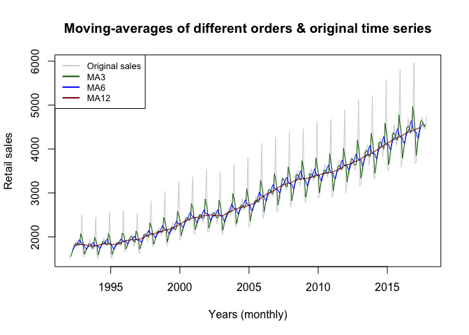

Moving-average of order 12 extracts appropriate trend.

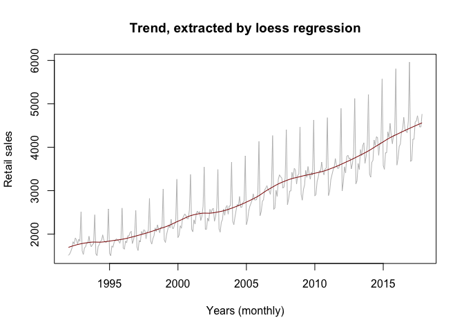

Trend, extracted by loess regression is smoother and has no NA values,
unlike in moving-average technique, so I'll use fitted values of loess
regression to compute seasonal & irregular components.

Seasonal & irregular components computations. Time-series decomposition
-----------------------------------------------------------------------

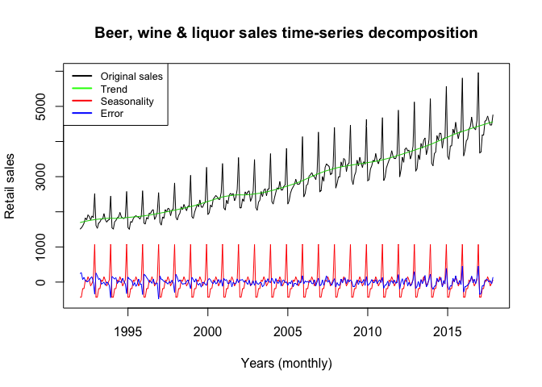

Autocorrelation function plot of irregular time-series component
----------------------------------------------------------------

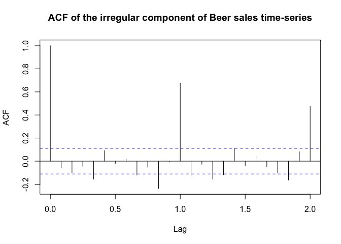

At autocorrelation function plot we see that there's still unextracted
information at the 12-th lag of irregular component, so probably we
havent extracted all seasonality from the time series, maybe because of
the growth, which could be not linear.
